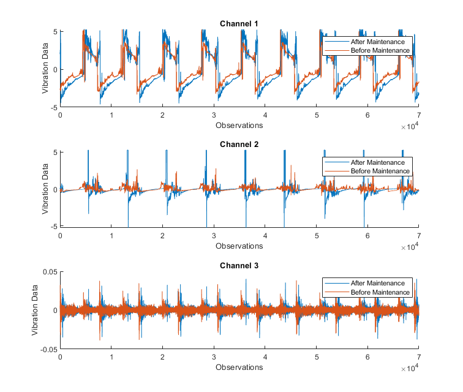
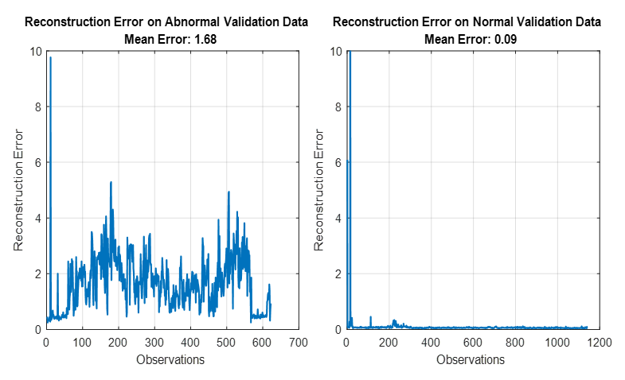

# Industrial Machinery Anomaly Detection using Autoencoders
<!-- This is the "Title of the contribution" that was approved during the Community Contribution Review Process --> 

  

This is a Predictive Maintenance example that trains a deep learning autoencoder on normal operating data of an industrial machine. The example walks through exctracting relevant features from the raw data, setting up and training an LSTM-based autoencoder to detect abnormal behavior, and evaluating the results on a validation set.
This demo is implemented as a MATLAB project and will require you to open the project to run it. The project will manage all paths and shortcuts you need. 

 
  

## Setup 
To Run:
1. Open the MATLAB Project file
2. Step 2

Additional information about set up

### MathWorks Products (http://www.mathworks.com)

Requires MATLAB release R#### or newer
- [Predictive Maintenance Toolbox](https://www.mathworks.com/help/predmaint/index.html)
- [Deep Learning Toolbox](https://www.mathworks.com/products/deep-learning.html)

## Examples
To learn how to use this in testing workflows, see [Examples](/examples/). 
<!--- Make sure you have a repo set up correctly if you are to follow this formatting --->

## License
<!--- Make sure you have a License.txt within your Repo --->
LICENSE NAME © 2021 The MathWorks, Inc.

or

The license for <insert repo name> is available in the [LICENSE.TXT](LICENSE.TXT) file in this GitHub repository.

Include any other License information here, including third-party content using separate license agreements 

## Community Support
[MATLAB Central](https://www.mathworks.com/matlabcentral)

Copyright 2021 The MathWorks, Inc.

<!--- Do not forget to the add the SECURITY.md to this repo --->
<!--- Add Topics #Topics to your Repo such as #MATLAB  --->

<!--- This is my comment --->

<!-- Include any Trademarks if this is the first time mentioning trademarked products (For Example:  MATLAB&reg; Simulink&reg; Trademark&trade; Simulink Test&#8482;) --> 

